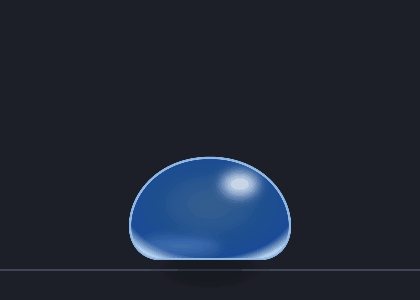
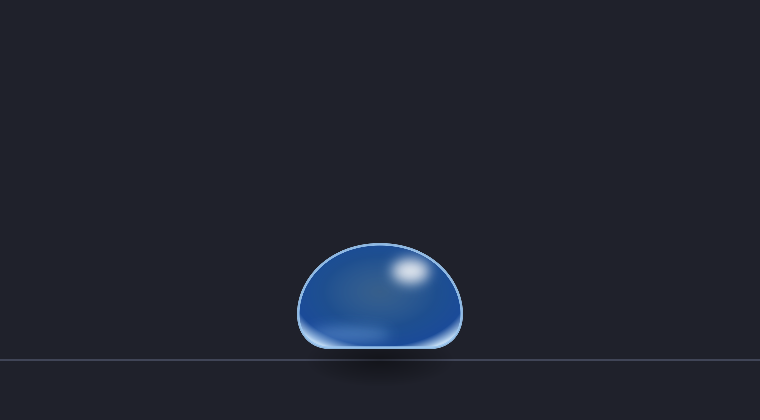
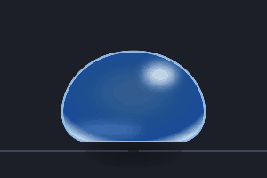

# 透明宠物 · TransparentPet（Unity）

> 一张贴在桌面上的“活”史莱姆：透明置顶窗口、像素级点击穿透、拖拽抛掷物理、呼吸与挤压的生命感。
> Unity 2022.3 重制版，是 Godot 4 桌宠原版（Project Astra）的引擎迁移实践——玩法规则不变，实现全部重写。





## 玩法

- 常驻桌面：背景全透明、始终置顶、不抢焦点，鼠标落在宠物身上才可交互（像素级 alpha 命中），其余区域直接穿透到桌面
- 拖拽抛掷：按住拖动，快甩松手走抛物线；落在任务栏上沿回弹、左右撞墙反弹
- 生命感：静息时呼吸起伏，被拖动时身体向运动方向倾斜，落地按冲击速度压扁再弹回，戳一下会弹
- 双窗口召唤：液态玻璃主窗口 + 物种副窗口双进程配对（父死子亡 Job Object + 窗口存活信号双向联动）；托盘右键召唤/收回四种史莱姆，**左键单击直接打开设置窗口**
- 设置窗口：经典白色对话框风，四页签管理桌宠数量（●×N 增减）、抛射物理、窗口行为（置顶/抓屏隐形/开机自启）；改动秒级热应用到两只窗口
- 位置记忆：退出前的位置自动落盘，下次启动回到原地



## 技术亮点

| 模块 | 说明 |
|---|---|
| Win32 窗口互操作（`Platform/`） | 透明 / 置顶 / 点击穿透（UniWinC 接入）；`SPI_GETWORKAREA` 工作区地面（自动扣除任务栏，落底不吃点击）；`Shell_NotifyIcon` 托盘 + 隐藏消息窗口 + 手写消息泵 + 子菜单递归构建；托盘图标由 `LoadImageW` 从 exe 资源提取；注册表开机自启；JSON 配置持久化 |
| 交互物理（`Pet/ThrowPhysics`） | 从 Godot 版 `drag_controller.gd` 逐行移植：拖拽速度滑动窗口 → 抛射初速（夹上下限）、重力、地面/墙壁反弹、接地摩擦；纯 C# 无场景依赖，NUnit 可直接实例化测试 |
| 生命感表现（`Pet/PetLifeMath`+`PetLifeVisual`） | 逻辑位置与渲染变换分层：物理只读写逻辑位置，表现层在 `LateUpdate` 叠加呼吸/倾角/挤压——视觉装饰永不污染模拟；落地挤压用半隐式欧拉弹簧（欠阻尼 ζ≈0.27，1~2 次回弹过冲即“Q 弹”来源）；同一套数学被离线快照工具复用，保证“演示图 = 真实行为” |
| 渲染性能（`Pet/Glass/GlassRenderRect`+`Core/FramePacing`） | 液态玻璃主合成是逐像素重活（每像素贝塞尔 SDF + 法线再 ×2），全屏绘制在核显 2560×1440 上要 **78.6 ms/帧**。改为按包围盒算出绘制矩形，quad / 素材与模糊 RT / 抓屏区域全部收敛到它（shader 端 `_ScreenUvRect` 把 uv 换算回屏幕坐标，画面逐像素不变）；主合成再加**两级剪枝**：远离玻璃的像素按“轮廓外必然全透明”的半径提前退出（该半径由抗锯齿带宽决定、只有 8px，而不是早先误算的阴影尾巴 126px；判定点吸附到 2×2 quad 原点，否则混合 quad 会污染邻居的屏幕空间导数、在轮廓外浮出一圈假阴影），以及逐项 AABB 下界跳过；法线由中心差分改**前向差分**并复用调用方已算出的中心值（每像素 5 次 SDF → 3 次）。同机实测 **4.3 ms/帧（单只，1.9×）**、**11.0 ms/帧（两只融合，2.4×）**（相对上一轮起点；相对最初的整屏绘制累计约 18× / 11×，两只分散在本机核显 2560×1440 下已进 60fps）。**再把 quad 与来源矩形解耦**：主合成只画“轮廓 + 8px”（合成像素数 −71.5%），而模糊/素材/抓屏这些**被采样**的纹理仍留 116px 边距，采样改走 `_BlurRemap`/`_BgRemap` 的屏幕 uv 换算——同进程交替**配对**实测再省 **0.6~0.7 ms/帧**（两只）。另加空闲降帧：拖拽/悬停全速，静置 1.5 秒后按刷新率跳帧到 30fps（核显常驻不再全天候满渲染） |
| 工程化 | 场景程序化生成（`SceneGenerator`）：不手写场景 YAML，克隆工程一条命令复原全部场景与图标；七个历史版本场景存档（`Assets/Scenes/Versions/`，index 0 = 交付默认）；**143 项 NUnit 测试**（物理/命中/软体/配置/事件总线/表现数学/渲染范围/帧率策略/托盘菜单）；性能与观感改动都带可复现锚定工具（`PerfProbe` 耗时探针，含分段定位 + 配对口径 + `LiquidGlassSnapshot` 定点图 + `tools/perfcmp.py` 三联对比图） |

## 快速开始

**直接体验（Windows）**：从 [GitHub Releases](https://github.com/fanboran/transparent-pet-unity/releases) 下载 `TransparentPet_v0.4.0_win64.zip` 解压后双击 `TransparentPet.exe`（透明桌宠·双窗口形态：液态玻璃主窗口 + 物种副窗口；托盘右键召唤/收回四种史莱姆，左键打开设置窗口）。

**从源码构建**：

```bash
# 生成全部版本场景（克隆工程后首次必需）
"F:/Unity/2022.3.62f1c1/Editor/Unity.exe" -batchmode -quit \
  -projectPath "transparent-pet" \
  -executeMethod TransparentPet.EditorTools.SceneGenerator.GenerateAll

# 构建 Windows x64（输出 transparent-pet/Builds/TransparentPet.exe，构建后自动注入应用图标）
"F:/Unity/2022.3.62f1c1/Editor/Unity.exe" -batchmode -quit \
  -projectPath "transparent-pet" \
  -executeMethod TransparentPet.EditorTools.BuildPlayer.BuildWindows64
```

编辑器内体验：Unity Hub 打开 `transparent-pet/`，打开 `Assets/Scenes/Versions/LifeVisual/PetScene.unity` 直接 Play（透明/穿透行为需在构建产物中验证）；液态玻璃版打开 `LiquidGlass/PetScene.unity`。

## 已知限制与故障处理

- **多开**：由 `CrashGuard` 的命名互斥体做单实例保护——已有实例在运行时再次双击，新进程会立即自退出。例外：两次启动几乎同时（间隔 < 约 20 秒、前一个实例尚未稳定）时，后启动的进程可能卡在显卡初始化（Windows/驱动层的资源竞争，此时应用代码还未开始运行，无法拦截），任务管理器结束它即可
- **异常自愈**：启动看门狗（30 秒未进入渲染循环即硬退出）+ **运行期心跳看门狗**（主线程停滞 10 秒、5 秒复核无恢复即强杀——任何形态的"卡死占屏"存活上限约 15 秒，配对进程由联动退出收尾）、托管层未处理异常兜底、构建产物不包含崩溃处理器（`UnityCrashHandler64.exe`，它在崩溃时会挂起进程）——异常路径一律"死得干净"，进程始终可被正常终止
- **双进程配对**：玻璃与物种两个进程互为配对——玻璃死亡由 Job Object（`KILL_ON_JOB_CLOSE`）让操作系统即时带走子进程（实测 0.5 秒内）；物种死亡由玻璃侧窗口存活信号在数秒内联动退出，不留孤儿窗口
- **万一失控**（窗口残留 / 进程不响应）：任务管理器结束 `TransparentPet.exe`（两进程都会被退出链带走）即可；极少数情况下进程会卡在显卡驱动调用中导致无法结束（Windows 层面的现象，非本程序可拦截），此时注销或重启系统清除
- 窗口是全屏透明覆盖层（宠物可在屏幕任意位置移动），这是透明桌宠的常规实现；对应代价是"渲染异常时遮挡整个桌面"。若需进一步降低失败影响面，可改为窗口跟随宠物包围盒（见 [docs/项目/待办事项.md](docs/项目/待办事项.md)）

## 项目结构

```
transparent-pet/Assets/
├── Scripts/
│   ├── Core/     # 事件总线 + 配置持久化 + 双进程角色环境 + 失控保护
│   ├── Platform/ # Win32 互操作（透明窗口/托盘/抓屏/开机自启/启动藏窗）——全项目唯一碰 Win32 的地方
│   ├── Pet/      # 拖拽抛射物理、生命感表现、PBF 软体（存档版）、角色注册表
│   ├── UI/       # 设置面板、HUD 提示
│   └── Editor/   # 场景生成、构建入口、门面图渲染、图标装配
├── Art/         # 贴图（PetSlime）、着色器、应用图标
├── Scenes/Versions/  # 版本场景存档（一版本一目录）
└── Tests/       # NUnit 测试
tools/           # 图标生成 / GIF 合成脚本（Python + Pillow）
```

## 版本存档（`Assets/Scenes/Versions/`）

| 版本 | 形态 |
|---|---|
| **LiquidGlassDesktop**（玻璃线的完成形态） | 真液态玻璃桌面版：抓屏隐形（`WDA_EXCLUDEFROMCAPTURE`）+ 折射真实桌面，**多只同屏**（≤3，smin 液滴融合）；F11 切换隐形（代价：隐形时录屏/截图中桌宠不可见） |
| LiquidGlass | 液态玻璃史莱姆：SDF 轮廓 + 折射/色散/菲涅尔/眩光（移植自 Godot 版液态玻璃演示），棋盘格素材只在玻璃内可见（桌面版的素材回退形态） |
| LifeVisual | 烘焙贴图原样 + 生命感表现层（呼吸/拖拽倾斜/落地挤压/戳反应） |
| BakedTexture | 纯烘焙贴图：`PetSlime.png` 原样显示，零着色器零表现层 |
| SvgClassic | 贴图仅作 alpha 轮廓，颜色由 `Slime.shader` 玻璃着色器计算 |
| PbfGravity | PBF 粒子软体（重力常开趴姿版，`SlimeLiquid` metaball 场渲染） |
| PbfHover | 第一个流体物理版本（PBF + 等值线 mesh 渲染）：落定关重力悬浮，拉扯过猛时轮廓断裂碎成块 |

版本约定：观感/行为迭代一律作为独立版本场景永久保留，不做运行时开关；构建 exe 打 `Scenes/Delivery/` 双窗口三场景（Bootstrap 入口按 `-species` 参数分岔到 Glass/Species，玻璃线即上表的 LiquidGlassDesktop 形态）。**新方案取代旧方案时，旧效果必须先 resurrect 成独立版本场景再下架**。分裂/融合玩法（撞墙分裂 + 分身吸引融合）曾是其一：PBF 重构时被下架、后按约定复活，**2026-09-18 用户拍板彻底删除**（体验不达预期，git 历史可考）。


## 与原版（Godot）的关系

本项目是 Godot 4 桌宠原版（Project Astra）的引擎迁移：玩法规则不变，实现全部重写。

- 窗口交互：Godot 原版为自写 C++ GDExtension（Win32 `WS_EX_TRANSPARENT`/`WS_EX_LAYERED` 像素级点击穿透、`Shell_NotifyIcon` 系统托盘、任务栏图标隐藏）；该扩展暂未作为独立仓库公开。Unity 版改用 [UniWinC](https://github.com/kirurobo/UniWinC) 接入同类窗口能力。
- 交互物理：`Pet/ThrowPhysics` 由 Godot 版 `drag_controller.gd` 逐行移植。

## 文档

- [docs/README.md](docs/README.md) — 文档索引（按设计 / 技术 / 项目分类导航）
- [docs/项目/待办事项.md](docs/项目/待办事项.md) — 开发节奏与归档
- [docs/技术/spike-透明窗口.md](docs/技术/spike-透明窗口.md) — 透明窗口技术验证记录
- 姊妹项目（Godot 原版）：`../game/transparent-pet/`
